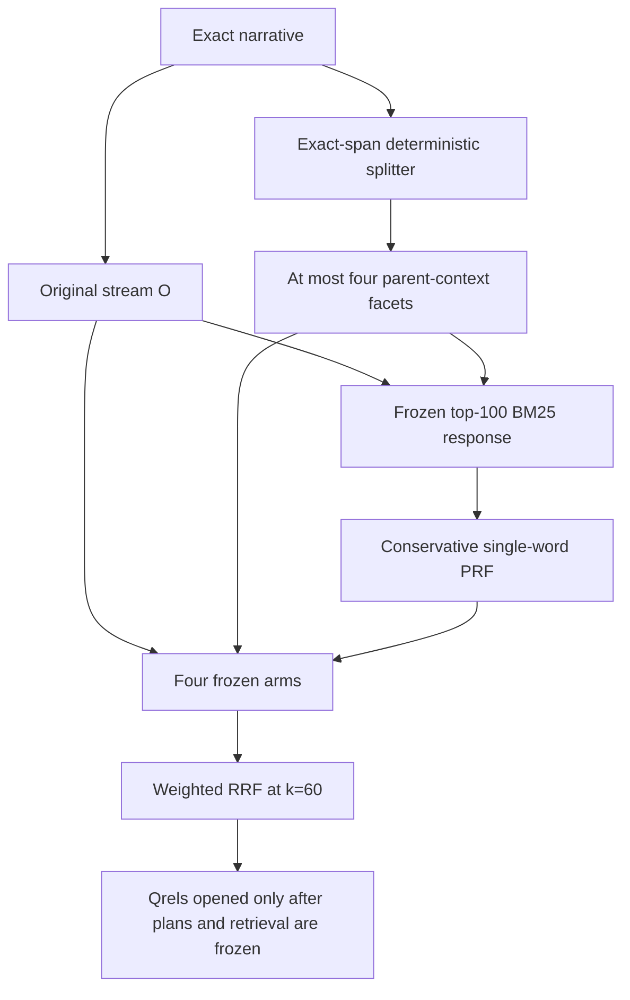

# Deterministic sparse retrieval v1

Date: 2026-07-11

Status: frozen implementation contract; external retrieval is not authorized by
this document.

## Decision

Open a separate, non-generative `det_sparse_v1` arm. Preserve the v1, v2, and
v2.1 planner code and recorded outcomes byte-for-byte. In particular, do not
retry or repair the failed v2.1 synthetic emission, call its locked five topics,
download another model, run a reranker, or use an agent as a repair loop.

This arm always keeps the exact original narrative, derives facets only from
exact narrative ranges, derives optional vocabulary expansion only from frozen
BM25 responses, and fuses incomparable retrieval streams by rank rather than by
raw BM25 score.

The diagram intentionally has no hard-coded light-theme colors so that it is
legible in dark mode.

## 1. Exact source and facet contract

For each topic, record the exact topic ID and narrative, its UTF-8 SHA-256, the
existing `narrative_token_tape_v1` tape, the splitter version, and the pinned
reference-analyzer fingerprint. The exact narrative is stream `O` and occurs in
every arm.

The splitter produces a partition of source-backed request units:

- split after sentence punctuation (`.`, `?`, or `!`), semicolon, or colon
  only when the punctuation is at end of text or followed by whitespace; this
  avoids splitting punctuation with no following boundary, but it is not a
  complete abbreviation detector and may still split an initialism before
  whitespace;
- additionally split at a comma or coordinator only when the following text
  begins one of the frozen request cues `I`, `Could`, `Can`, `what`, `why`,
  `how`, `who`, `when`, `where`, `whether`, or `which`, optionally after `and`,
  `or`, or `also`;
- do not split ordinary noun lists;
- keep exact Unicode-code-point half-open source ranges and never fuzzy-match,
  paraphrase, or copy model-authored text;
- require every narrative token-tape lexical token to belong to exactly one
  source unit before shared context is copied.

The first nonempty unit is the shared parent `P`. Its own facet query is `P`
once. Every later facet query is `P + exact unit`, joined with one ASCII space.
Exact duplicate components are not repeated. This makes a missing global
entity kind and an invalid global-to-local reference structurally impossible:
there are no semantic anchor kinds or free-form reference IDs in this arm.

Analyzer-identical rendered facets are merged without dropping their source
ranges. If more than four facets remain, merge the adjacent pair with the
fewest combined unique analyzed terms; ties choose the earliest pair. Require
one to four stable facets, at least three unique analyzed terms per rendered
facet, source ranges in order and nonoverlapping, and no analyzed query term
absent from the narrative. An invalid construction records its exact failure
and transforms that topic to original-only; it never emits a partial plan.

This is deliberately conservative. It does not claim generic semantic
atomicity, and an ambiguous coordination remains together. The permanent
original stream protects recall when a syntactic boundary is not recognized.

## 2. Expansion contract

Expansion is a separate pseudo-relevance-feedback ablation. It does not use a
model, hand-written topic synonyms, qrels, nuggets, or manual judgments.

For the exact frozen top-100 response of the original and each eligible
non-parent facet (`f02` through `f04`):

- foreground documents are ranks 1–5 and background documents ranks 6–50;
- a candidate is a lowercase single surface word containing 3–24 Unicode
  letters, mapping to exactly one reference-analyzer token;
- the analyzed form must be absent from the base query, occur in at least two
  foreground documents, and occur in fewer than 40 of the top 50 documents;
- score analyzed form `t` as
  `log((df_F(t)+0.5)/6) - log((df_B(t)+0.5)/46)`;
- retain only positive scores and at most two terms;
- choose a surface form by foreground document frequency, then top-50
  occurrence frequency, then lexical order;
- order analyzed candidates by score descending, foreground document
  frequency descending, and analyzed form lexical order;
- append retained surface words plainly; the rule cannot emit a phrase,
  number, or query operator and introduces no model- or manually-authored
  term.

A corpus-mined lowercase word can still be an entity, mechanism, cause,
candidate answer, or otherwise query-drifting. This arm does not claim semantic
safety from lexical constraints. It limits and fully audits that risk, and the
independent expansion ablation plus paired guardrails determine whether the
terms help.

The audit stores every eligible and rejected candidate, counts, score,
selection reason, exact base-query hash, ledger request key, raw response hash,
canonical candidate hash, retriever version, analyzer fingerprint, and rendered
expanded-query hash. Zero retained terms is a valid no-op and causes no
duplicate retrieval request.

## 3. Four arm semantics and fusion

The frozen arms are:

| Arm | Unique streams | Weights |
|---|---|---|
| `O` | exact original | original `1.0` |
| `F` | original + base facets | original `0.5`; facet family `0.5/M` each |
| `E` | original + expanded original | original `0.5`; expanded original `0.5` |
| `FE` | original + base facets + expanded original + expanded non-parent facets | original `0.5`; base facets `0.25/M` each; expanded original `0.125`; eligible expanded facets share `0.125` |

`M` is the number of base facets. Parent facet `f01` is never expanded because
it is already the copied shared context; at most `f02`, `f03`, and `f04` are
eligible, and their family weight is divided by the number of eligible
non-parent facets. A no-op expansion contributes no stream and its unused
weight is not reassigned. Identical exact query strings are retrieved once and
cannot receive duplicate RRF contributions; if two logical roles collide, the
larger frozen weight is retained and the suppressed membership is recorded.

Within each stream, deduplicate by document ID and best rank. Fuse with
weighted reciprocal-rank fusion:

`RRF(d) = sum_s weight(s) / (60 + rank_s(d))`

Never average or normalize raw BM25 scores across queries. Break equal fused
scores by best contributing source rank and then lexical document ID. Preserve
every contributing stream, source rank, source score, weight, and RRF
contribution. The formal four-topic run requires exactly 100 ranked documents
per arm and topic; a shorter result is a mechanical failure.

## 4. Retrieval ledger and cost boundary

External responses are part of the experiment evidence, not disposable stage
memory. Before any call, persist a create-only attempt record containing the
topic, variant, exact query and hash, retriever version, endpoint, index ID,
hit count, analyzer hash, request key, ordinal, and budget. A pending attempt
counts as spent and cannot be retried after a crash.

Persist successful raw HTTP bytes with `fsync` before UTF-8/JSON parsing. Then
validate status, request identity, response hash, document IDs, ranks, at least
50 text-bearing results, and canonical candidate hash. This is the reusable
ledger floor; the formal executor additionally requires exactly 100 returned
rows before proceeding. The generic ledger can verify exact cache entries, but
the formal pilot disables pre-existing shared
cache reuse because the hosted index has no revision fingerprint. Exact query
aliases and all four arms reuse the one response inside the same fresh run.
Missing, partial, raw-only, or tampered entries fail closed. Derived PRF, arm
membership, RRF, and metrics must be rebuildable without a network call.

The diagnostic pilot has exactly four topics, at most four facets, `hits=100`,
and at most nine unique queries per topic: one original, four facets, one
expanded original, and at most three expanded non-parent facets. The exact
per-topic projection is derived from each frozen plan, and the persisted ledger
also stops before request 37 globally. A second create-only ticket ledger lives
under the Git common directory, so linked worktrees cannot reset the
experiment-wide ceiling. The sole admissible transport is bound to
`https://api.castorini.uwaterloo.ca/v1/climbmix-400b/search`, performs one HTTPS
GET, follows no redirect, and has no retry loop. The formal pilot records zero
shared cache hits. The run records planned, attempted, completed, failed, and
cached counts; per-attempt latency and returned hits; and zero model/reranker
calls.

Implementation and synthetic validation occur before this gate. No external
request is authorized merely because the code passes. In this version the gate
is deliberately hard-closed: the hosted collection reports
`hosted_climbmix_unknown_revision`, so the external executor raises before a
global ticket or network call. Opening it requires an immutable hosted index
revision and a separately reviewed, versioned authorization decision.

## 5. Pilot and qrels firewall

The advisor froze topic IDs `200`, `225`, `707`, and `897`: the four lowest
previously reported original-BM25 nDCG@10 topics outside the locked planner
five. This is intentionally a qrel-conditioned challenge set, not a clean or
representative sample, and it supports no significance or generalization
claim. The locked planner topics `144`, `213`, `224`, `407`, and `515` remain
untouched by this arm.

Query construction, retrieval, and PRF cannot accept a qrels path. Before qrels
are opened, freeze and hash topic identities, facet plans, analyzer, splitter,
PRF rule, query strings, raw response identities, RRF weights/tie-breaks,
metrics, source commit/tree, Python environment, endpoint/index, hit depth,
and both cost ledgers. Final validation reloads the canonical config, binds the
loaded Python modules to that clean checkout, rebuilds exact plans with the
loopback analyzer, recomputes PRF from verified raw-ledger candidates,
reconstructs all arm memberships and weighted-RRF rankings, and rejects any
semantic mismatch before opening qrels. Evaluation hashes and parses one exact
qrels byte snapshot, so resulting metrics and promotion evidence carry both
the qrels hash and frozen ranking hashes. Evaluation must reject a missing or
changed freeze manifest.

On an ungraded test set, apply a confirmed winner unchanged. For every logical
stream and arm, let `D_s` be its top-100 document-ID set and `D_O` the original
top-100 set. Report `|D_s - D_O|` as `unique_vs_original_at_100` and
`|D_s intersection D_O| / |D_s union D_O|` as
`jaccard_with_original_at_100` (defined as `1.0` when both are empty). Also
report verified external calls, cache hits, and summed raw-response elapsed
seconds globally and per topic. These are qrels-free diagnostics of behavior
and cost, not relevance measurements or promotion gates.

## 6. Preregistered metrics and decision gates

Use the same four topics, index snapshot, depth, and projected development
qrels for every arm. Primary metric is paired `recall@100`. Secondary metrics
are `graded_recall@100`, `ideal_dcg_coverage@100`, `recall@50`, `nDCG@10`, new
unique relevant documents, stream overlap, calls, cache hits, and latency.
For each arm/topic, new relevant documents are exactly
`|(D_arm - D_O) intersection R_q|` at depth 100 for grades at least 2; preserve
their sorted document IDs as audit evidence. Overlap, cost, and latency use the
qrels-free definitions above. All of these diagnostics are descriptive only
and do not alter a gate.

- Mechanical: 4/4 valid preflights and complete retrieval, no fallback, at
  most 36 external calls.
- Facets advance when mean `F-O recall@100 >= +0.010`, at least 3/4 topic
  deltas are nonnegative, mean nDCG@10 loss is no worse than `-0.02`, and no
  topic nDCG@10 loss is below `-0.10`.
- Expansion advances when mean `E-O recall@100 >= +0.005` with the same paired
  and ranking guardrails.
- Combined advances only when mean `FE-O recall@100 >= +0.015`, at least 3/4
  deltas are nonnegative, both mean `FE-F` and `FE-E recall@100 >= +0.0025`,
  and the ranking guardrails pass.

If combined fails, retain only an independently passing component. If neither
component passes, retain original BM25. Do not tune segmentation, PRF, RRF
`k`, weights, or thresholds on these four topics. Any rule change burns the
challenge set and requires a fresh preregistered confirmation set.

## 7. Deferred work

Dense full-collection retrieval, cross-encoder or full reranking, larger local
models, paid APIs, RM3 sweeps, and an agent/controller remain out of scope. An
agent may be reconsidered only as a future, separately costed exception handler
after deterministic ablations expose an observable miss that cheaper methods
cannot address.
