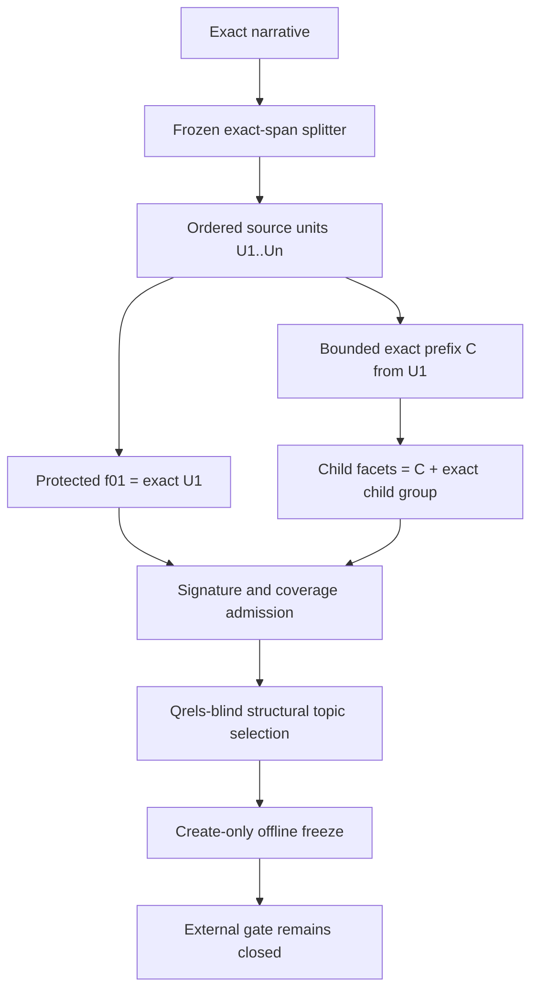

# Deterministic sparse retrieval v2

Date: 2026-07-11

Status: frozen offline admission contract. It is a new version after the sealed
`det_sparse_v1` preflight received a scientific no-go. This document does not
authorize external retrieval.

## Decision

Preserve every v1 source commit and artifact. Open `det_sparse_v2` with new
planner, renderer, selection, experiment, output, budget, plan, and freeze
identities. V2 retains the exact original query and the conservative
facet/expansion ablations, but fixes the v1 collapse where `P + child`
reconstructed the original on two-unit narratives.

The diagram has no theme-specific colors and remains legible in dark mode.

## 1. Version and isolation

- Planner/schema: `det_sparse_v2`.
- Renderer: `det_sparse_bounded_parent_renderer_v2`.
- Splitter: `det_sparse_exact_span_splitter_v1`.
- Narrative token tape: `narrative_token_tape_v1`.
- Selection: `det_sparse_structural_selection_v2`.
- Experiment: `rag25_det_sparse_structural4_v2`.
- Output: `outputs/rag25_det_sparse_structural4_v2`.
- Selection seed: `det_sparse_v2_structural_selection_20260711`.
- No v1 plan, query registry, response, cache, ticket, output, or freeze may be
  imported into v2.

V2 reuses byte-for-byte behavior where the semantics are unchanged: the
`narrative_token_tape_v1` tape, v1 exact-span splitter, pinned Lucene 10.4
reference analyzer, PRF term-scoring formula, raw-first ledger primitives,
weighted RRF implementation, qrels firewall, and descriptive diagnostics.
Reused code remains explicitly bound in v2 source provenance.

The local analyzer runtime is also byte-bound: both Lucene JARs, both compiled
server classes, the exact Java container image digest and image ID, launch
command/environment, read-only cache mount, and loopback port are attested.
The launcher defaults to the immutable image digest and contacts the registry
only if that digest is absent locally.

## 2. Bounded shared context

Split the exact narrative into `U1..Un` with the unchanged v1 splitter. A
formal v2 topic requires at least two units. Let `E` be the number of unique
reference-analyzer terms in `U1`; require `E >= 4`. Define
`K = min(6, floor(E/2))`.

Enumerate exact contiguous prefixes of `U1` ending at narrative-token
boundaries. Among prefixes with 2 through `K` unique analyzed terms, choose the
one with the largest unique-term count; break a tie by the shortest Unicode
code-point end offset. The selected shared context `C` must:

- be a strict exact prefix (`C.end < U1.end`);
- contain 2 through `K` unique analyzed terms;
- have an analyzed occurrence multiset that is a strict sub-multiset of U1;
- preserve its exact span, token IDs, analyzer tape/signature, and complete
  candidate-selection audit.

There is no generated text, topic-specific vocabulary, fuzzy match, or manual
entity extraction.

## 3. Protected parent and child grouping

Seed one coverage group per source unit. `f01` covers only `U1`, renders exact
`U1` once, and is protected: it may never participate in a cap merge.

If more than four groups exist, merge only adjacent groups among `U2..Un`.
Choose the adjacent pair whose exact combined coverage substring has the
fewest unique analyzed terms; ties choose the earlier pair. Repeat until four
groups remain. A short child may merge with an adjacent child, never
automatically with the parent. Every merge and exact before/after coverage span
is audited.

Each non-parent group renders:

`exact C + one ASCII space + exact source substring covering the child group`

The child substring starts at the first covered unit and ends at the last, so
intervening punctuation and whitespace are source-backed. Deduplicate only an
actual C/component overlap; never append all of U1.

For two units the final queries are explicit:

- `O` = exact original narrative;
- `f01` = exact `U1`;
- `f02` = bounded strict prefix `C + " " + exact U2`.

Thus the child retains a bounded topic cue while omitting substantial U1
vocabulary. Admission still verifies that its retrieval signature is genuinely
different from O.

## 4. BM25-signature and coverage admission

The BM25 query signature is the sorted term-frequency multiset of the reference
analyzer output, represented as sorted `(term, count)` pairs. It intentionally
ignores token order in the same way bag-of-words sparse retrieval does.

A formal plan passes only if every condition holds:

- exact O is byte-preserved and permanent;
- there are two through four facets;
- `f01` covers exactly `u001`, renders exact U1, and no merge touches u001;
- every lexical token belongs to exactly one unit and every unit belongs to
  exactly one final facet coverage group;
- every facet contains only exact source material plus C and has at least three
  unique analyzed terms;
- every facet string and BM25 signature differs from O;
- all facet BM25 signatures are pairwise distinct; v2 admits no base
  facet/original canonical alias;
- canonical base request count equals exactly `1 + facet_count`;
- every non-parent coverage unit contributes at least one analyzed term absent
  from C;
- every coverage unit maps to a final facet with a non-original signature;
- every facet analyzer occurrence count is strictly smaller than O's;
- all spans and hashes resolve exactly and the analyzer fingerprint stays
  stable.

Analyzer-identical final facets are an admission failure, not silently merged.
Any failure produces an auditable original-only fallback and makes the focused
pilot a no-go; no partial transformed plan advances.

## 5. Qrels-blind fresh-topic selection

Exclude locked planner topics `144`, `213`, `224`, `407`, and `515`, plus
burned v1 topics `200`, `225`, `707`, and `897`. The exact candidate universe,
sorted numerically, is:

`14, 31, 37, 58, 72, 84, 161, 219, 233, 273, 300, 477, 499`.

No qrels, nuggets, baseline scores, report metrics, model, reranker, or external
retrieval may be read during screening. Apply the frozen v2 planner to every
candidate and preserve a complete table containing topic/narrative hashes,
unit count `U`, original unique-term count `N`, plan hash, eligibility, and
exact failure reasons.

Eligible topics form four strata:

- A: `U=2`, lower-length half;
- B: `U=2`, upper-length half;
- C: `U=3`;
- D: `U>=4`.

Sort eligible `U=2` topics by `(N, numeric topic_id)`; A is the first
`ceil(m/2)` and B the remainder. Within each stratum choose the lexicographically
smallest digest of:

`SHA256(seed + NUL + topic_id + NUL + narrative_sha256)`.

If any stratum is empty or fewer than four topics are eligible, stop. There is
no manual replacement, bin change, seed change, or topic-specific repair. The
four selected topics become burned once their exact final plan shapes are
viewed. Any renderer/admission change requires a new version and selection.

## 6. Offline preflight

Run only after committing a clean source tree. Create, without qrels or
external calls:

- a create-only attempt reservation before any candidate screening;
- exact config and source/runtime provenance;
- all-candidate structural table and selection manifest;
- four selected exact plans and plan hashes;
- base query registry and coverage-unit path ledger;
- create-only pre-retrieval freeze.

The formal entry point constructs a fresh canonical loopback Lucene client; it
does not accept a caller-supplied analyzer or provenance attestation. Source,
runtime, config, and topic evidence are checked before screening, again before
artifact writes, and again after sealing. The CLI then performs a fresh exact
semantic replay before it can report success.

The hard gate requires exact selection reproduction, four of four valid plans,
zero fallback and aliases, exact `1 + M` base requests per topic, every coverage
unit on exactly one non-original path, zero model/reranker/external calls, and
`qrels_opened=false`.

After mechanical validation, an advisor reviews only qrels-blind query shapes:
each child must be interpretable as a search request given C, narrower than O,
coverage-complete, and protected from the v1 collapse. Any failure archives v2
as a no-go; the selected topics cannot be repaired or rerun.

## 7. Arms, expansion, and cost

If a future separately authorized retrieval milestone exists, use the same
four semantic arms and weights as v1:

- O: original, weight 1;
- F: O weight .5; M distinct base facets share .5;
- E: O .5; expanded O .5;
- FE: O .5; base facets share .25; expanded O .125; expanded eligible
  non-parent facets share .125.

Parent f01 remains ineligible for PRF by frozen policy and cost, not because it
is merely copied context. PRF keeps the v1 ranks 1–5 versus 6–50 formula,
single-lowercase-word constraints, document-frequency gates, and maximum two
terms, but writes a v2 artifact/provenance identity. Expanded exact queries and
BM25 signatures must be distinct from every registered query/signature or
become audited no-ops with no call.

With `M<=4`, base requests are `1+M` and eligible expansion bases are
`1+(M-1)=M`, for a maximum `1+2M <= 9` per topic and 36 over four topics.
Use a new fresh run-local ledger and v2 global-ticket namespace; no v1 cache or
ticket reuse. The frozen namespaces are `det_sparse_v2_fresh_run_local` and
`rag25_det_sparse_structural4_v2`. Exact 100-row results, one attempt, no retry,
and no redirect remain mandatory.

## 8. Evaluation and interpretation

External execution remains hard-closed while the hosted collection revision is
`hosted_climbmix_unknown_revision`. If a future version receives immutable
index identity plus advisor and user authorization, retain the v1 metrics and
promotion gates unchanged to avoid post-hoc tuning. Descriptive
novelty/overlap/cost/latency remains non-gating.

Any result applies only to this deterministic renderer and structurally
selected four-topic diagnostic. It does not establish that decomposition or
expansion works generally and does not prove whether an agent is necessary.
