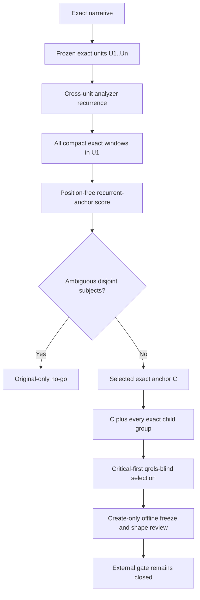

# Deterministic sparse retrieval v3

Date: 2026-07-11

Status: frozen offline admission contract. V3 is a new version after the sealed
`det_sparse_v2` preflight received a scientific no-go because bounded leading
prefixes preserved request boilerplate but lost the subject of two child
queries. This document does not authorize retrieval, qrels access, model
inference, reranking, or an agent.

## Decision

Use a deterministic recurrent topical anchor extracted as an exact compact
span anywhere inside the first source unit. Do not use a local model in v3.
The intervention changes only anchor selection; the exact splitter, protected
parent, child grouping, sparse-signature admission, and cost boundary remain
isolated and auditable.



The diagram uses no theme-specific colors and remains legible in dark mode.

## 1. Version and isolation

- Planner/schema: `det_sparse_v3`.
- Renderer: `det_sparse_recurrent_anchor_renderer_v3`.
- Anchor selector: `det_sparse_cross_unit_recurrent_anchor_v1`.
- Selection: `det_sparse_anchor_critical_quantile_selection_v3`.
- Experiment: `rag25_det_sparse_structural4_v3`.
- Output: `outputs/rag25_det_sparse_structural4_v3`.
- Seed: `det_sparse_v3_recurrent_anchor_selection_20260711`.
- Splitter: `det_sparse_exact_span_splitter_v1`.
- Narrative token tape: `narrative_token_tape_v1`.

No v1 or v2 plan, query registry, response, cache, ticket, output, selection,
or freeze may be imported into v3. V3 may reuse source code whose semantics are
unchanged only when that dependency is explicitly hash- and import-bound.

The local Lucene runtime retains the v2 byte-level attestation: exact JARs,
compiled server classes, immutable container image digest and ID, launch
command/environment, read-only cache mount, and loopback port.

## 2. Fresh candidate boundary

The exact remaining candidate universe, numerically sorted, is:

`14, 31, 58, 72, 219, 233, 273, 477, 499`.

Exclude the known-five planner topics, burned v1 topics, and burned v2 topics:

`37, 84, 144, 161, 200, 213, 224, 225, 300, 407, 515, 707, 897`.

Only the nine candidate narratives may be decoded. Screening must not read
qrels, baseline scores, prior metrics, retrieval results, reports containing
graded evidence, a model, a reranker, or any noncandidate narrative.

## 3. Token-aligned recurrence evidence

Split a narrative into exact units `U1..Un` with the unchanged splitter. A
formal topic requires at least two units and at least four unique analyzer
terms in U1. Analyze each unit and retain exact source spans, narrative-token
IDs, analyzer tokens, BM25 signatures, and the stable analyzer fingerprint.

V3 freezes occurrence alignment instead of assuming that a stem has a source
offset. Analyze the exact text of every `narrative_token_tape_v1` record
individually. For every unit, concatenating the per-token analyzer outputs in
token-ID order must equal the analyzer output for the exact whole-unit text.
Otherwise return `token_analyzer_alignment_mismatch`. Each aligned occurrence
records analyzer term, token ID, exact surface, half-open source span, and unit
ID. A surface token may produce zero, one, or several analyzer occurrences.

The following exact surface inventory is a versioned dependency named
`det_sparse_conversational_surfaces_v1`:

```text
a, about, also, an, and, answer, are, ask, asking, at, be, been, being, but,
by, can, could, curious, deeper, describe, description, detailed, did, discuss,
discussion, do, does, explain, explanation, finally, for, from, gain, had, has,
have, he, her, hers, him, his, hope, hoping, how, i, i'd, i’d, i'm, i’m,
identify, in, information, interest, interested, is, it, its, know, knowing,
learn, learning, like, liked, list, look, looking, may, me, might, must, my, of,
on, or, our, ours, overview, please, provide, question, report, say, shall, she,
should, tell, that, the, their, theirs, them, these, they, this, those, to,
understand, understanding, want, wanted, wants, was, we, we're, we’re, were,
what, why, will, with, would, you, your, yours
```

Normalize a token surface only for inventory lookup with Unicode NFKC followed
by casefold; call this `unicode_nfkc_casefold_v1`. Exclusion is occurrence-level:
only analyzer occurrences emitted by a token whose normalized exact surface is
in the normalized inventory are conversational. A matching analyzer stem from
a different, noninventory surface remains eligible. Freeze and hash the source
list, normalized unique list, surface-to-analyzer projection, projected term
set, analyzer fingerprint, and every excluded occurrence. This explicitly
audits stem collisions rather than globally blacklisting stems.

For each analyzed term t with at least one eligible nonconversational occurrence
in U1, record:

- `parent_tf(t)`: eligible occurrence count in U1;
- `child_df(t)`: number of distinct raw pre-merge units U2..Un with an eligible
  occurrence of t;
- `child_tf(t)`: eligible occurrence count across raw pre-merge units;
- exact supporting occurrence and unit evidence.

An eligible occurrence is recurrent exactly when its term has `child_df(t)>=1`.
Recurrence is analyzer identity, not a semantic-equivalence claim. No generated
vocabulary, fuzzy match, corpus retrieval, model, or topic-specific rule
participates.

## 4. Compact coherent anchor candidates

A candidate window is a consecutive sequence of one through six U1-owned token
tape records; punctuation records count toward six. The first and last records
must each emit at least one analyzer occurrence. Its source span begins at the
first record start and ends at the last record end, retaining intervening exact
punctuation and whitespace. Token IDs must be consecutive. Its evidence hash is
SHA-256 of compact, sorted-key, UTF-8 JSON with no trailing newline and exactly
these keys and value types:

```json
{"end":0,"narrative_sha256":"lowercase hex","start":0,"text_sha256":"lowercase hex","token_ids":[0]}
```

`start` and `end` are Unicode code-point offsets and `token_ids` are ordered
zero-based tape indices. Two candidate evidence rows are duplicates only when
narrative hash, start, end, text hash, and token IDs are all identical. Never
collapse distinct source spans because analyzer text or signatures match.

For candidate c, let T(c) be all unique analyzed terms and R(c) the unique terms
having both an eligible nonconversational occurrence inside c and
`child_df(t)>=1`. Let `joint_child_df(c)` be the number of raw child units whose
eligible term set contains all of R(c). A candidate is admissible only when:

- every token/span/hash resolves exactly inside U1;
- it contains two through four unique analyzed terms;
- `|R(c)|>=2`;
- recurrence precision is at least 2/3, tested without floats as
  `3*|R(c)| >= 2*|T(c)|`;
- `joint_child_df(c)>=1`;
- full analyzed occurrences are no more than
  `min(6, floor(parent_full_occurrences/2))`;
- its analyzed occurrence multiset is a strict sub-multiset of U1;
- its analyzer fingerprint is unchanged.

For each admissible candidate define:

```text
recurrence_mass(c) = sum(
  child_df(t) * min(parent_tf(t), 3) for t in R(c)
)

core_score(c) = (
  joint_child_df(c),
  recurrence_mass(c),
  |R(c)|,
  |union of child unit IDs supporting a term in R(c)|,
  - eligible nonrecurrent occurrence count in c,
  - conversational occurrence count in c,
  - total analyzed occurrence count in c,
  - source token-record count in c
)
```

Offsets never influence this position-free score. Preserve every admitted and
rejected candidate plus every arithmetic component.

For a candidate/core pair, enumerate every consecutive subwindow inside the
candidate whose unique eligible recurrent term set equals exactly R(c). Keep
all inclusion-minimal such windows as its recurrent-core hulls; do not choose a
single hull by position. Canonicalize duplicate candidates only for selection,
never by deleting audit rows.

A recurrent core is maximal when no admissible candidate has a strict superset
of that core. Before scoring among maximal-core candidates, compare every pair
of distinct maximal cores. Return original-only
`ambiguous_recurrent_anchor`—regardless of unequal scores—when the cores are
disjoint and any corresponding inclusion-minimal hull pair has nonoverlapping
half-open spans. Preserve all cores, hulls, scores, and evidence. This rejects
separately supported subjects while allowing one compact admissible window to
represent their jointly supported union.

If no ambiguity exists, consider only candidates whose core is maximal.
Maximize `core_score`, then choose by later start offset, shorter Unicode
code-point span, and finally lexicographically smaller unsigned UTF-8 byte
sequence. If none exists, return `recurrent_anchor_unavailable`. No alternate
heuristic or model runs.

The selected exact anchor C preserves its full analyzed occurrence multiset and
`A_core`, one copy of each lexicographically sorted unique term in R(C).

## 5. Criticality, protected parent, and child grouping

Criticality is computed from exact raw pre-merge units U2..Un. For each unit,
freeze both (a) the intersection of A_core with its full aligned analyzer term
set and (b) the intersection with only eligible nonconversational occurrences.
The selection gate uses the full analyzer intersection so the anchor must add a
previously absent BM25 core term; the eligible intersection remains a separate
source-semantics and stem-collision audit. Label the unit from the full set:

- `anchorless` when the intersection is empty;
- `partial` when the intersection is nonempty but not all of A_core;
- `complete` when it contains every A_core term.

Only full-set `anchorless` qualifies a topic for the critical-first selection pool.
Partial gaps remain descriptive. Presence semantics are intentional; repeated
term frequency is not referent injection.

Seed one coverage group per source unit. `f01` covers exactly U1, renders exact
U1, and never merges. If more than four groups exist, merge only adjacent child
groups with the unchanged minimum-combined-unique-terms rule and earliest-pair
tie-break. Merge scoring analyzes the exact combined child substring before the
anchor is added. Preserve exact left, right, and combined before/after spans.

For every final child group, analyze the exact raw coverage substring before
anchoring and freeze both full and eligible core intersections. At least one
final group in the selected forced-critical topic must remain full-set
anchorless; otherwise preflight stops with `selected_critical_merge_masked` and
does not select a replacement.

Every final child facet renders:

`exact C + one ASCII space + exact contiguous child coverage substring`.

Anchoring is unconditional. Every rendered child must contain the full anchor
analyzer occurrence multiset. Every final raw child group must also contribute
at least two unique eligible nonconversational analyzed terms absent from the
full anchor term set; otherwise that plan is ineligible with
`insufficient_child_payload`.

## 6. Sparse-query admission

The original O is exact and permanent. A formal plan passes only if:

- there are two through four facets;
- f01 is exact U1 and no merge touches U1;
- every token-tape record and source unit has exactly one final coverage owner;
- every facet has at least three unique analyzed terms;
- every facet exact text and BM25 term-frequency signature differs from O;
- all facet texts and signatures are pairwise distinct;
- every facet has fewer analyzer occurrences than O and is a strict analyzer
  occurrence sub-multiset of O;
- every child contains the full selected anchor signature and every A_core term;
- raw-unit and final-group full/eligible criticality exactly replay from aligned
  occurrences;
- every final child satisfies the two-term nonconversational payload rule;
- anchor and child source spans are exact, disjoint, and resolve to O;
- concatenated anchor and child analyzer tapes equal analysis of the rendered
  query;
- every source unit has exactly one non-original retrieval path;
- analyzer and source/runtime fingerprints remain stable.

Any failure returns the exact original only and makes that candidate ineligible.
No partial transformed plan advances.

## 7. Critical-first qrels-blind selection

Screen all nine candidates and preserve source/narrative hashes, U, original
unique-term count N, facet count M, merge count, `A=|A_core|`, anchor/core
hashes, raw and final criticality counts, semantic plan hash, eligibility, and
exact failure reason.

Stop if fewer than four candidates are eligible. Let K be eligible topics with
at least one raw `anchorless` child; stop with `no_anchor_critical_topic` if K
is empty.

Encode the seed and topic ID as UTF-8 bytes and narrative SHA-256 as its 64
lowercase ASCII hex bytes:

```text
digest = SHA256(seed_utf8 + NUL + topic_id_utf8 + NUL + narrative_sha_ascii)
```

Choose the K row with smallest lowercase digest, breaking an impossible digest
collision by numeric topic ID. Remove it. Sort the r remaining eligible rows by
exactly `(min(U,4), N, M, A, numeric_topic_id)`.

Require `r>=3`. For k=0,1,2, bin k is the zero-based half-open slice
`rows[floor(k*r/3):floor((k+1)*r/3)]`. Each bin is nonempty. Choose the smallest
digest in each bin, with numeric ID only as a digest-collision tie-break. Final
order is `critical, bin0, bin1, bin2`.

The critical selection is not reconsidered if its final-group witness is masked
by merging; preflight stops. There is no replacement, resampling, seed change,
bin adjustment, or topic-specific repair. The four topics become burned when
their exact shapes are viewed. Any rule change requires a new version and fresh
topics.

## 8. Offline preflight and shape review

Run only from a committed clean source tree with the digest-pinned loopback
analyzer. The formal API constructs a fresh exact analyzer client and computes
provenance internally. It creates a reservation before candidate screening,
re-attests before writes and after sealing, and performs a fresh exact semantic
replay before reporting success.

Before the first candidate read, synthetic tests must cover: Unicode,
punctuation, apostrophe, hyphen, analyzer-zero and one-to-many token alignment;
generic-only recurrence; surface-level lexicon stem collisions; repeated
generic terms versus a compact subject; one-word recurrence rejection and
multiword recurrence admission; split
versus jointly supported core terms; equal- and unequal-strength disjoint
subjects; overlapping/nested nonambiguous cores; multiple minimal hulls;
deterministic score/tie directions; no recurrence; strict two-unit reduction;
odd parent occurrence counts 7 and 9; raw zero/partial/full core overlap;
merge-masked criticality; discourse-only child payload; protected-parent cap
merges; analyzer drift; reconstruction/signature collisions; digest collision;
and exact quantile slices for r=3,4,5,8. Replay tests must reject any altered
surface, offset, support, score, hull, criticality label, selection, or hash.

Freeze the conversational inventory and analyzer projection, token occurrence
alignment, complete candidate table and recurrence evidence, four selected
plans, all anchor/core/hull audits, raw and final criticality ledgers, exact
query registry, coverage ledger, request projections, config/source/runtime
identities, and exact artifact inventory. Require four valid plans, a selected
raw-anchorless critical topic with an unmasked final-group witness, no fallback
or aliases, zero external/model/reranker calls, and `qrels_opened=false`.

After mechanical validation, two independent reviewers inspect only the four
qrels-blind selected shapes. Every child must explicitly retain the main
topic/referent, give pronouns or ellipsis a usable antecedent, be understandable
without sibling queries, remain narrower than O, and retain meaningful
child-specific terms. The selected critical case must show that the inserted
recurrent core supplies a referent to the raw and final anchorless child. One
failure archives v3 as a scientific no-go without repair or resampling.

## 9. Arms, cost, and model boundary

A future separately authorized retrieval milestone would retain O/F/E/FE,
weighted RRF, and conservative PRF as frozen in v2. Parent f01 remains
ineligible for expansion. With M<=4, the ceiling remains `1+2M <= 9` per topic
and 36 total. The fresh-run namespace is
`det_sparse_v3_fresh_run_local`; the global-ticket namespace is
`rag25_det_sparse_structural4_v3`. Future execution requires exactly 100
results, one attempt, no retry, and no redirect.

External execution remains hard-closed while the hosted collection revision is
`hosted_climbmix_unknown_revision`. Passing v3 preflight and shape review would
not authorize retrieval.

A local model is not a v3 fallback. If deterministic recurrence abstains or
fails later, a model-assisted challenger must use a new version and untouched
topics. It may select only exact source token spans, with pinned local weights,
runtime, seed, one call per topic, no retry, and the same mechanical and human
gates. A larger or hosted model is justified only by measured incremental gain
over the smallest viable local challenger.
