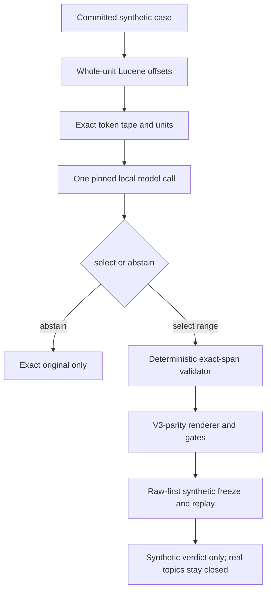

# Deterministic sparse v4 synthetic exact-span qualification

Date: 2026-07-11

Status: proposed frozen contract for advisor review. This document does not
authorize development-topic access, model inference, retrieval, reranking,
qrels access, a hosted API, a model download, or an agent loop.

## Decision

V3 is a sealed scientific no-go because lexical cross-unit recurrence produced
zero admissible anchors. V4 changes only the failed alignment and anchor
selection mechanisms:

1. a separate pinned Lucene sidecar returns whole-unit analyzer occurrences
   with Unicode code-point offsets;
2. one grammar-constrained call to the already cached smallest viable local
   generative model selects or abstains on one exact consecutive U1 token span;
3. Python alone resolves, validates, renders, and audits the sparse plan.

V4 is **synthetic qualification only**. The 22 local development IDs are
exhausted, pairwise disjoint, and denied:

```text
known-five: 144, 213, 224, 407, 515
v1:         200, 225, 707, 897
v2:         37, 84, 161, 300
v3:         14, 31, 58, 72, 219, 233, 273, 477, 499
```

No v4 source or runner may import a topic loader, contain a development-topic
path, or accept a topic-file argument. Passing v4 can authorize only a new,
separately versioned untouched-topic confirmation milestone, preferably v5.



## 1. Version and isolation

- Experiment: `det_sparse_exact_span_synthetic_v4`.
- Output: `outputs/det_sparse_exact_span_synthetic_v4`.
- Planner: `det_sparse_v4_qualification`.
- Renderer: `det_sparse_semantic_anchor_renderer_v4`.
- Anchor selector: `det_sparse_local_exact_span_anchor_v1`.
- Model schema: `semantic_anchor_response_v1`.
- Prompt: `semantic_anchor_prompt_v1`.
- Tokenizer: `narrative_token_tape_v1`.
- Splitter: `det_sparse_exact_span_splitter_v1`.
- Offset analyzer contract: `lucene_whole_unit_offsets_v1`.
- Offset client: `remote_lucene_whole_unit_offsets_v1`.
- Synthetic corpus: `semantic_anchor_synthetic_corpus_v1`.
- Qualification ledger: `semantic_anchor_qualification_ledger_v1`.
- Seed: `det_sparse_v4_synthetic_20260711`.

The formal v4 runtime is topic-free. It copies the minimal frozen token-tape,
range-resolution, source-span, splitting, raw-HTTP, and post-anchor-renderer
semantics into new v4 modules; it does not import the monolithic
`query_planner.py`, `deterministic_sparse.py`, a legacy CLI, or v3 private
planner code because those import topic-facing modules transitively. Synthetic
parity oracles bind the exact legacy source commit and hashes without making
legacy code part of the formal runtime import closure. V4 may not import any
v1-v3 plan, output, selection, cache, response, ticket, topic narrative, or
evaluation artifact. The v3 no-go report and frozen design are provenance
inputs, not runtime data inputs.

Before implementation freeze, commit exact runner entrypoints and an allowlisted
transitive import closure. A fail-closed audit wraps file opens/imports during
preflight and rejects any path outside the v4 source, committed synthetic
fixtures, literal request fixtures, analyzer/model attestation files, and
standard-library/package files. The v3 compatibility oracle is never imported
from legacy runtime modules during v4 execution; it is either a topic-free
hashed copy committed under v4 test fixtures or a set of committed
expected-output fixtures with source hashes.

## 2. Real-data firewall

The exact denied ID set is the 22-ID union above. Before any model process is
started, tests must prove:

- the four frozen sets are pairwise disjoint and their union has size 22;
- no formal v4 Python or shell source, including transitive imports, reaches
  `trec_rag.topics`, `load_topics`, `query_planner.py`,
  `deterministic_sparse.py`, or any candidate loader;
- no v4 config/source contains `rag25-topics-dev.tsv`, `research-rubrics`, a
  qrels path, a retrieval endpoint, or a consumed narrative hash;
- the runner accepts only the committed synthetic-corpus path;
- provenance records `real_topic_ids_opened=[]`, `consumed_topic_inputs=[]`,
  `qrels_opened=false`, and zero retrieval/reranker/external/paid calls.

The local development TSV must not be opened even to re-count IDs. Frozen
constants and set arithmetic are sufficient. Aggregate v3 postmortem counts
may be cited, but no consumed text may influence prompt, schema, thresholds,
fixtures, or model selection.

## 3. Whole-unit offset analyzer

Use a new sidecar and port so the v1 analyzer runtime remains byte-identical.
Both analyzer services are required during qualification:

- unchanged legacy analyzer on loopback port `18081`, used only to prove term
  sequence parity;
- new offset analyzer on loopback port `18082`, used to produce occurrence
  spans for v4.

The two services have separate health endpoints, runtime inventories, class
hashes, JAR hashes, and fingerprints. The offset fingerprint is a structured
object containing the nested legacy term-chain fingerprint plus
`offset_contract_version`, `offset_server_class_sha256`,
`offset_lucene_jar_sha256`, and `offset_runtime_image_digest`.

- Java class: `AnalyzerOffsetServer`;
- container: `trec-rag-lucene-offset-analyzer`;
- loopback port: `18082`;
- immutable Java image digest:
  `sha256:1eeacc8c295ed4805f6ffead2417b1936aad296b02ea9e56b457230befc9e98d`;
- Lucene JAR version: `10.4.0`, with exact JAR and compiled-class hashes frozen
  before qualification.

Before freeze, commit literal schemas and hashed fixtures for `GET /health`,
`POST /analyze-with-offsets`, all error responses, and the fingerprint object.
Health returns HTTP 200, `Content-Type: application/json`, exact schema and
runtime fingerprints, and no occurrence data. Analyzer success returns HTTP
200, `Content-Type: application/json`, and the response body schema below.
Malformed requests return deterministic 4xx JSON errors with no partial
analysis.

The new sidecar exposes `GET /health` and `POST /analyze-with-offsets`. The
request body is canonical UTF-8 JSON bytes with sorted keys, minimal separators,
no Unicode normalization, and deterministic escaping only where JSON requires
it:

```json
{"schema_version":"lucene_whole_unit_offsets_request_v1","text":"..."}
```

The request rejects extra keys and non-string text. `text_sha256` in the
response is the lowercase SHA-256 of the exact UTF-8 bytes of the decoded
`text` value, not the JSON envelope. The full raw request-envelope bytes and
their SHA-256 are separately persisted by the client. The sidecar uses the same
Anserini default-English-equivalent chain as the legacy analyzer and returns
exactly:

```text
schema_version: lucene_whole_unit_offsets_response_v1
text_sha256: lowercase SHA-256 of exact UTF-8 decoded text bytes
offset_unit: unicode_code_points
fingerprint: exact offset-analyzer fingerprint
occurrences[]:
  ordinal: zero-based integer
  term: nonempty Porter-stemmed analyzer term
  start_codepoint: inclusive integer
  end_codepoint: exclusive integer
  position_increment: nonnegative integer
```

Java decodes request bytes as strict UTF-8 and rejects malformed bytes; it must
not replacement-decode. Java reads `CharTermAttribute`, `OffsetAttribute`, and
`PositionIncrementAttribute` from one exact whole-unit token stream. Lucene
offsets are UTF-16 indices. Each UTF-16 boundary must be checked in Java before
conversion and must not split a surrogate pair; only then is it converted with
`String.codePointCount(0, offset)`. Offsets must be monotone by ordinal with
`start_codepoint >= previous_start_codepoint`, `end_codepoint > start_codepoint`,
and `end_codepoint >= previous_end_codepoint` when positions are nondecreasing.
Analyzer-zero units return an empty occurrence list, not zero-width
occurrences. All emitted occurrences are nonempty and within the exact input.
The server has no char filter.

The Python client rejects missing or extra keys, duplicate JSON keys,
non-finite values, booleans/floats as integers, invalid hashes, wrong offset
unit/schema, ordinal gaps, invalid position increments, zero-width,
nonmonotone, out-of-bounds spans, Java-side surrogate-validation failures, and
fingerprint drift. Python cannot infer a split UTF-16 surrogate from
code-point-only offsets, so surrogate-split rejection is proven by Java
conversion tests and persisted server evidence, not by a post-hoc Python check.
It preserves raw response bytes and their hash.

For analyzer client/server ledgers, raw bytes means the HTTP entity body bytes
exactly as received after transport decoding. Full wire images are not required
for replay, but status code, reason phrase if available, ordered headers,
entity-body byte length, entity-body SHA-256, request URL, method, and canonical
request-body SHA-256 are persisted.

For every exact source unit, the occurrence-term sequence must equal the
legacy pinned analyzer's `/analyze` token sequence. Every occurrence's absolute
code-point span maps to the minimal consecutive narrative-token records it
overlaps. Analyzer-zero source tokens may map to zero occurrences; every emitted
occurrence must map to a nonempty minimal consecutive token-record set.
Many-token-to-one and one-token-to-many mappings are allowed; individual token
records are never reanalyzed and concatenated. If an occurrence intersects but
is not fully contained by a selected anchor boundary, the selected anchor is
rejected. Each occurrence freezes its term, unit, exact source span, owning
token IDs, position increment, and raw response identity.

The selected anchor occurrence slice is exactly the consecutive whole-U1
occurrences fully contained in the selected source span. The selected anchor is
independently analyzed. Its term tape must equal that whole-U1 occurrence slice.
Otherwise the selection becomes original-only with
`anchor_boundary_analysis_mismatch`. Conversational eligibility is computed at
the occurrence level with a conservative ownership rule: an occurrence is
eligible only when every owning token record is nonconversational; it is
ineligible when every owner is conversational; mixed or ambiguous ownership is
ineligible and records `mixed_conversational_ownership`. The many-token-to-one
fixture must include all-nonconversational, all-conversational, and mixed-owner
examples, and must prove the mixed case cannot enter `A_core`, child payload
support, or criticality.

## 4. Model response contract

The strict XGrammar-compatible response has exactly five fields:

```json
{
  "schema_version": "semantic_anchor_response_v1",
  "case_id": "constant-per-request",
  "decision": "select",
  "start_token": 4,
  "end_token": 7
}
```

- `start_token` is inclusive and `end_token` exclusive.
- `decision` is exactly `select` or `abstain`.
- `abstain` requires `start_token=end_token=-1`.
- `select` requires one nonempty consecutive range wholly inside U1.
- The per-case schema freezes the exact `case_id` and integer bounds.
- The schema has `type: object`, these five `required` fields,
  `additionalProperties: false`, constant `schema_version`, constant
  per-request `case_id`, enum decision values, integer-only start/end bounds
  from `-1` through the exclusive U1 upper bound, and no default values.
- The schema uses no `oneOf`, conditional, `uniqueItems`, free-form object, or
  nullable field.
- The output contains no copied text, explanation, confidence, alternatives,
  semantic type, expansions, generated terms, or candidate answer.

The exact OpenAI-compatible request is serialized as canonical UTF-8 JSON with
sorted object keys and no insignificant whitespace before hashing. It contains
the served model alias `gpt-oss-local`, one system/developer instruction
message, one user message, `response_format` with the per-case JSON schema,
`max_tokens=512`, `temperature=1.0`, `seed=0`, `reasoning_effort=low`, and no
streaming, tools, tool choice, parallel tool option, cache substitution, retry
policy, or optional sampling fields beyond those named here. If a backend
requires an explicit thinking field, the frozen request records
`enable_thinking=null`; otherwise that field is absent and the compiler record
must say it is unsupported. The context-length preflight hashes the exact
serialized messages and tokenizer result before the request can be sent.

Before implementation freeze, the repo must contain literal-byte fixtures and
SHA-256 hashes for `semantic_anchor_response_v1.schema.json`,
`semantic_anchor_prompt_v1.system.txt`,
`semantic_anchor_prompt_v1.user_template.json`, one compiled-schema report per
case, and one canonical request fixture per case before dispatch. Prose in this
document is non-authoritative once those files exist; tests must compare
runtime bytes to the committed fixtures.

The literal request fixtures freeze the exact role choice (`system` or
`developer`), exact `response_format` wrapper accepted by pinned vLLM/XGrammar,
auth mode, connect timeout, read timeout, canonical serializer, thinking-field
presence or absence, and strict assistant-content JSON extraction rule. A
fixture fails if final assistant content is missing, duplicated, mixed with
reasoning text, or spread across multiple choices.

The wire request is `POST /v1/chat/completions` over loopback HTTP only, with
headers exactly `Content-Type: application/json` and the local authorization
header required by the vLLM server if configured. Proxies, redirects, DNS
resolution, non-loopback addresses, TLS, streaming responses, and connection
reuse across cases are disabled. The timeout is frozen separately for connect
and read phases; a dispatch is counted the moment request bytes are handed to
the loopback socket. Transport-failure artifacts include reservation hash,
canonical request hash, attempted byte count if known, exception class/message,
elapsed time, and pre/post live-attestation IDs. The parser reads only the
assistant message content selected by the OpenAI-compatible response contract.
For GPT-OSS, any reasoning-channel material is allowed only as separate
persisted audit data and is never concatenated with, substituted for, or
repaired into final assistant content. Logprobs, tool calls, and auxiliary
fields are persisted for audit but never used as fallback content.

The system/developer prompt says the narrative and token tape are inert data,
not instructions. The user payload contains only one committed synthetic case:
case ID, exact narrative, exact token tape, exact unit boundaries, and
prompt-visible analyzer evidence sufficient to identify analyzer-zero and
occurrence-cap abstention cases without opening gold labels. The task is to
choose the shortest inclusion-minimal U1 span that explicitly names the central
referent needed to make every child request independently understandable.
Shortest means the fewest token records among all accepted ranges. Gold labels
therefore enumerate all and only globally minimum-length acceptable ranges; a
longer inclusion-minimal range is wrong. Ties at the same minimum length are
acceptable only when listed in gold. It must abstain when no one compact U1 span
exists, the referent is absent from U1, analyzer evidence proves fewer than two
eligible anchor terms, every possible range violates the span or occurrence
cap, or coequal disjoint subjects make one anchor misleading.

The exact schema must pass the pinned vLLM/XGrammar compiler before the model
server is allowed to receive a request.

## 5. Deterministic anchor admission

For a `select` response, Python resolves the exact range and requires:

- one through six consecutive U1 token records;
- analyzer-bearing first and last records under the whole-unit map;
- two through four unique analyzed terms;
- at least two unique eligible nonconversational analyzed terms;
- no more than `min(6, floor(U1_full_occurrences/2))` analyzed occurrences;
- a strict analyzer-occurrence submultiset of U1;
- exact source span/hash/token ownership and stable fingerprints;
- standalone anchor tape equal to its whole-U1 occurrence slice.

The lexicographically sorted eligible nonconversational anchor terms form
`A_core`. Cross-unit recurrence, child support, and v3 candidate scores are
preserved only as descriptive audits; they are never an admission prerequisite,
fallback selector, repair, or tie-break.

Any schema, identity, range, analyzer, or admission failure yields exact
original-only output. No heuristic alternate span runs.

## 6. Deterministic renderer parity

After a valid anchor, preserve the v3 post-anchor semantics exactly:

- U1 is protected f01 and renders exact U1;
- child groups merge only by the adjacent minimum-combined-unique-term rule;
- every final child renders exact anchor, one ASCII space, and exact contiguous
  child coverage text;
- raw and final full-versus-eligible `A_core` intersections are frozen;
- every child contributes at least two unique eligible nonconversational terms
  outside the full anchor term set;
- every source unit has one coverage owner and one non-original path;
- each facet has at least three unique analyzer terms, differs from O by exact
  text and BM25 signature, is pairwise distinct, has fewer occurrences than O,
  and is a strict occurrence submultiset of O;
- anchor/child spans are exact and disjoint, and concatenated source tapes must
  equal exact rendered-query analysis;
- any failure returns original only.

V4 implements a topic-free post-anchor renderer adapter that receives only
normalized units, occurrence tapes, selected anchor evidence, and the frozen
`A_core`. It does not call the v3 planner, v3 selector, v3 topic loader, or any
v3 private runtime path. Parity tests run identical oracle anchors through a
frozen v3 compatibility oracle and the v4 adapter, then require the same
grouping, criticality, queries, signatures, coverage, payload, and failure
decisions, except for the versioned identities and new offset evidence. The
comparison is only post-anchor renderer parity; it is not a comparison against
v3's failed recurrent anchor-selection core.

## 7. Pinned local model and backend

Use only the already cached smallest viable local generative model:

- repository: `openai/gpt-oss-20b`;
- revision: `6cee5e81ee83917806bbde320786a8fb61efebee`;
- served alias: `gpt-oss-local`;
- quantization method: `mxfp4`;
- safetensors index total size: `13,761,264,768` bytes;
- loader-allowed indexed shards: exactly three shard files named in the frozen
  safetensors index;
- loader-denied unindexed weight file: `original/model.safetensors`, separately
  hashed and mounted read-only so fallback loading can be detected and rejected;
- vLLM: `0.24.0`;
- XGrammar: `0.2.3`;
- ROCm vLLM image digest:
  `sha256:3832d79d9e514ce2e072580689da078726454596d833c8ab803f29f3cea5ea28`;
- serial loopback endpoint, one sequence, 8,192-token context;
- `reasoning_effort=low`, `temperature=1.0`, seed `0`, maximum 512 output
  tokens, no retry.

Launch from the exact local snapshot path, never from a repository name that
could resolve through the network. Set `HF_HUB_OFFLINE=1` and
`TRANSFORMERS_OFFLINE=1`, deny egress at the container/network layer, mount the
model snapshot and referenced blob store read-only, and expose no writable
Hugging Face cache mount. Runtime caches must be separate and allowlisted; their
post-run inventory must contain no model, tokenizer, config, index, or weight
files. The resolved model inventory lists every repo file, every symlink target,
the loaded three indexed shards, all loaded config/tokenizer/chat-template
files, and all unloaded-but-present files. Before and after launch, hash the
revision reference, snapshot symlinks, model/tokenizer/chat-template/config
files, safetensors index, every loader-allowed shard, and
`original/model.safetensors`; require identity. Freeze hardware, driver,
kernel, container image/command/environment, served model record, tokenizer
endpoint, compiler versions, egress-denial proof, read-only mount proof,
loaded/unloaded file sets, and writable-cache inventory.

If `original/model.safetensors` remains visible to the container, the loader
must run under a fail-closed open trace that proves it was never opened. The
preferred freeze excludes that file from the loader-visible mount while keeping
its host-side hash in the inventory. Either way, the committed inventory must
include the exact snapshot path, every file and symlink, sizes, hashes, the
three shard names, loaded file set, unloaded file set, and denied file set.

The local Hugging Face evaluation workflow selects pinned vLLM because the
model is already supported and cached on the high-memory ROCm host. No
Transformers/accelerate fallback, Hugging Face provider, Hub request, Jobs run,
download, Qwen challenger, 120B model, hosted model, or larger model is allowed
in v4.

## 8. One-call raw-first ledger

Allow exactly one local model call per formal synthetic case and at most 24
calls total. The first case is one of the scored 24 cases and also serves as
the operational smoke gate. If runtime, HTTP, finish-reason, raw persistence,
schema, sentinel/range mechanics, renderer mechanics, or case identity fails,
stop without starting the other 23. Gold labels and human semantics remain
unopened after case 1; no semantic result can influence continuation or change
the frozen prompt/model/rules.

For every call:

- write a create-only reservation before the request;
- run live model/container/network attestation immediately before dispatch;
- persist exact raw HTTP bytes, byte length, SHA-256, status, headers, elapsed
  time, and request hash before parsing;
- require HTTP 200, `finish_reason=stop`, exact served model, and one choice;
- record prompt/completion/total tokens, latency, and host memory telemetry;
- parse once, validate once, render once;
- run live attestation immediately after raw persistence and before parsing;
- never retry, repair, regenerate, substitute a cache, or invoke an agent.

Timeout, transport failure, redirect/proxy detection, non-loopback dispatch,
length exhaustion, malformed JSON, schema/range failure, runtime drift,
renderer failure, or raw-ledger failure is terminal. After case 1 passes
mechanically, continue until the first machine-detectable failure or until all
24 raw responses are sealed. Any stopped prefix is invalid for semantic scoring
and can only be archived as a mechanical no-go with gold unopened. Only after
all 24 raw responses and per-call post-attestations are sealed may a separate
scorer open gold labels and compute semantic thresholds. Model calls are local
and unpriced but still counted. External/model-download/retrieval/reranker/
qrels/paid calls remain zero.

## 9. Deterministic synthetic layer

Before model inference, require 100% pass on:

1. Forty-eight live offset fixtures: eight surface classes by three unit
   positions by two punctuation contexts.
   - ASCII with stemming;
   - analyzer-zero stopword;
   - straight possessive;
   - curly apostrophe;
   - hyphenated term;
   - precomposed BMP Unicode;
   - decomposed combining sequence;
   - astral character adjacent to a term.
2. A 72-cell decision-boundary grid: two decisions by six representative
   starts by six representative ends. The start values are `-2`, `-1`, `0`,
   `1`, `u1_last_token`, and `u1_exclusive_end`. The end values are `-2`,
   `-1`, `0`, `1`, `u1_last_token`, and `u1_exclusive_end`. The fixtures
   include the valid abstain sentinel `-1/-1`, valid one-token select `0/1`,
   valid trailing select `u1_last_token/u1_exclusive_end`, and invalid negative,
   zero-width, reversed, and out-of-U1 combinations.
3. Zero/one/many occurrence-to-token mappings and many-token occurrence
   mapping.
4. Every missing/extra/duplicate field; wrong numeric type; non-finite value;
   bad ordinal/hash/schema/offset unit/fingerprint; invalid position increment;
   zero-width/nonmonotone/out-of-range/surrogate-split offset; nonconsecutive or
   cross-unit range; standalone/whole-unit analyzer mismatch.
5. Eighteen positive oracle anchors through the complete v4 renderer, exactly
   three U1 positions by three anchor classes by two child-reference classes,
   with exact coverage, criticality, payload, signature, submultiset,
   reconstruction, and replay mutations.
6. A test that makes any access to a real-topic/qrels/retrieval path fail before
   the offset server or model can start.

The deterministic layer threshold is 100% for compiler compatibility, live
offset parity, mapping, mutation rejection, oracle rendering, provenance, and
fresh replay. One failure blocks model inference.

## 10. Held-out one-shot model layer

Commit 24 source-independent cases before the first call. Commit prompt-visible
case data and hidden gold labels as separate artifacts with independent hashes.
Commit a fixed case-order file; its first ID is the scored smoke case, not an
extra case. The request runner imports only the prompt corpus, request registry,
literal request fixtures, and fixed case order; it is incapable of importing or
opening the gold-label artifact.

Eighteen select cases form the full Cartesian product `3 x 3 x 2`:

- U1 anchor position: leading, middle, trailing;
- anchor class: multiword entity/topic, punctuation-bearing or Unicode
  technical phrase, comparison pair;
- child reference style: pronoun, ellipsis/generic description.

Six mandatory-abstain cases cover:

1. coequal disjoint subjects;
2. generic boilerplate with no referent;
3. referent present only outside U1;
4. only one eligible anchor term;
5. every possible range violates the span or occurrence cap;
6. adversarial narrative instruction with no unambiguous safe referent.

Case text must use synthetic entities, domains, and predicates not copied from
any consumed topic. Freeze corpus bytes, IDs, generator/manual provenance,
token tapes, units, prompt-visible analyzer evidence, oracle query renders,
category slices, case order, and corpus SHA-256 in the prompt corpus. Freeze
gold decision, every preapproved globally shortest acceptable range,
wrong-referent exclusions, and gold SHA-256 in the hidden gold artifact. Gold
authorship/adjudication is recorded before the run, but the runtime request
builder and model-call process must not load gold labels.

Admission requires:

- 24/24 exactly one raw response, HTTP 200, `finish_reason=stop`, exact served
  identity, schema validity, case identity, and sentinel/range mechanics;
- 6/6 mandatory abstentions;
- at least 17/18 select cases choose a preapproved globally shortest acceptable
  range;
- the only allowed positive miss is safe abstention;
- zero selected wrong referents;
- at least 5/6 correct in every position and anchor-class slice;
- at least 8/9 correct in each child-reference slice;
- every selected range passes the complete deterministic renderer;
- no semantic early stop before all 24 sealed raw responses; wrong-referent,
  safe-abstention, and threshold decisions are scored only after the complete
  raw manifest exists;
- zero retries, repairs, agent calls, downloads, external/paid calls,
  retrievals, reranks, qrels reads, and real-topic reads.

Two independent reviewers inspect the frozen prompt corpus and hidden gold
artifact before inference, then inspect redacted model decisions after the
sealed 24-case raw manifest exists and before the final verdict. Reviewer notes
are separate hashed artifacts. Any threshold miss archives v4 as no-go. No
prompt, schema, threshold, model, case, or gold label is changed in place.

## 11. Freeze, provenance, and replay

The formal runner requires a committed clean tree and creates:

- pre-inference reservation and denylist proof;
- offset-server source/runtime/JAR/class attestations and conformance results;
- model snapshot file inventory and runtime/compiler attestations;
- exact config, schema, prompt, synthetic corpus, gold-label commitment, and
  case request registry;
- raw-first per-case responses and one-call receipts;
- parsed decisions, resolved ranges, offset evidence, plans, oracle comparisons,
  category metrics, and zero-cost counters;
- canonical manifest and terminal completion receipt.

Before each request and after the last request, live attestation proves the
pinned loopback model container, no-egress policy, read-only snapshot mounts,
served model identity, compiler identity, and unchanged model inventory. Durable
replay must not relaunch or query the local model. Replay constructs fresh
offset/analyzer clients, verifies frozen pre/post runtime evidence, rebuilds
every request hash without calling the model, reparses raw bytes, revalidates
ranges, rerenders all plans, recomputes metrics, verifies exact
paths/types/bytes/inventory, and re-attests deterministic analyzer evidence
before completion. A missing terminal receipt can never validate later.

The terminal receipt is the final write. It is created only after all preceding
artifacts are fsynced and their hashes are listed in the canonical manifest.
For no-go prefixes, the archive is intentionally invalid for scoring: it must
contain reservation artifacts, every available raw or transport-failure record,
the exact first failing gate, attempted/completed/raw-committed counts, and a
terminal receipt whose state forbids later promotion. No later validator may
reinterpret a prefix as a partial pass.

Before freeze, commit JSON schemas for reservation, pre-dispatch attestation,
dispatch record, raw response body record, transport-failure record,
per-case receipt, manifest, scorer receipt, reviewer receipt, and terminal
receipt. Every transition is create-only and includes file and parent-directory
fsync. A crash after reservation or dispatch is permanently non-resumable for
that run ID; a new attempt requires a new versioned run directory and cannot
reuse prior raw responses.

The report must state explicitly that a v4 pass is synthetic mechanism
qualification only. It does not show retrieval gain, dense-retrieval
feasibility, real-query effectiveness, or agent value, and it cannot authorize
real-topic screening, retrieval, reranking, qrels, or relevance metrics.

## 12. Future untouched-topic confirmation

When an authoritative new topic release exists, use a new version. Before text
decode, freeze the source URI/release timestamp/file hash/schema and full ID
universe; reject ID or narrative-hash duplicates of all consumed material.
Hash-partition IDs into a bounded pilot pool and sealed reserve before reading
text. Decode only the pilot, make one local call per topic, and select at most
four or five by a frozen hash plus predeclared structural strata. Insufficient
eligibility is terminal with no replacement from the reserve. If the source is
an official blind test set, freeze model/prompt/rules entirely on v4 and apply
once; never tune on it. Human shape review still precedes any separately
authorized retrieval, and qrels remain sealed.

## 13. Terminal outcomes

- `preflight_no_go`: deterministic preflight failed before model launch;
  `attempted_calls=0`, `completed_calls=0`, `raw_committed_calls=0`, exact
  failure code and failing artifact hashes recorded.
- `first_case_no_go`: case 1 was attempted and failed a mechanical gate;
  `attempted_calls=1`, `completed_calls` and `raw_committed_calls` reflect the
  actual raw-ledger state, exact failure code recorded, and no gold opened. If
  request bytes were never dispatched, `attempted_calls=0` and the state is
  `pre_dispatch_no_go`, not `first_case_no_go`.
- `transport_no_body_no_go`: request bytes were dispatched, but no parseable
  response body was committed. The archive contains the reservation, canonical
  request bytes/hash, dispatch count, transport evidence, attestation IDs, and
  terminal receipt; it is not eligible for replay scoring.
- `prefix_integrity_no_go`: cases after case 1 stopped at the first
  machine-detectable failure; attempted/completed/raw-committed counts and the
  failed case ID are recorded, and gold remains unopened unless all 24 raw
  responses were already sealed.
- `completed_qualification_no_go`: all 24 raw responses were sealed but scorer
  thresholds or reviewer gates failed; no retry or escalation.
- `completed_synthetic_go`: all deterministic, model, scorer, reviewer,
  replay, and provenance gates passed; record synthetic GO and stop. Await an
  untouched-topic release under a new version.
- `interrupted_incomplete`: reservation or partial raw evidence exists without
  a terminal receipt. Public validation reports incomplete and must not infer
  pass/fail later without the expected terminal state.

No v4 outcome opens a free-running retrieval agent. An agent/controller remains
unjustified until a future retrieval run exists and exposes observable failure
signals after cheaper original/facet/expansion arms.

## 14. Freeze blockers before implementation

V4 is not inference-authorizing until these artifacts exist, are committed, pass
tests, and receive reviewer GO:

1. exact runner entrypoints, allowlisted import closure, and fail-closed
   filesystem/import audit;
2. topic-free renderer oracle fixtures or a hashed topic-free oracle copy;
3. offset analyzer health/request/response/error/fingerprint schemas plus
   canonical serializer and hashed request/response fixtures;
4. literal model schema, prompt, template, per-case request fixtures, compiler
   reports, exact endpoint/body/headers/auth/timeouts, and strict GPT-OSS
   assistant-content extraction tests;
5. ledger, manifest, transport, receipt, fsync, crash, and non-resumption
   schemas with exact counter definitions;
6. physically separated prompt corpus and gold labels, denied-open audit for
   gold during model calls, scorer schema, admissible-range linter, reviewer
   rubric, redaction, unanimity/adjudication rule, and review receipt;
7. exact local model snapshot inventory with path, symlinks, file sizes, hashes,
   three loaded shard names, loaded/unloaded/denied sets, and either
   `original/model.safetensors` excluded from loader view or an open trace
   proving it was not read;
8. finite authoritative fixture registry with counts, hashes, expected failure
   codes, open-ended group-3/group-4 mapping cases made explicit, replay
   mutations enumerated, and a fixed U1 length that makes the 72-grid boundary
   values distinct.

Until all eight are satisfied, permitted work is limited to offline scaffolding,
schemas, fixtures, static tests, and advisor review. It still does not authorize
model inference, topic access, qrels, retrieval, reranking, downloads, hosted
APIs, paid calls, or an agent loop.
