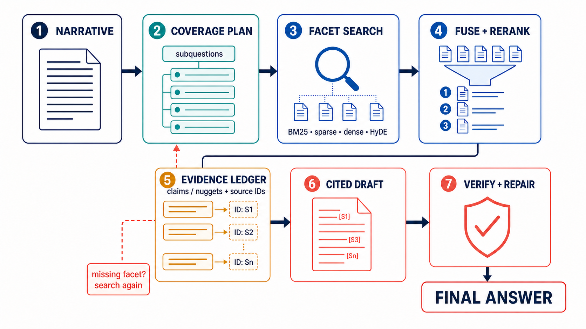

# The Most Promising TREC RAG 2025 Architecture

## Short answer

The most promising **architecture pattern** from TREC RAG 2025 was:

> **turn the narrative into explicit coverage units; retrieve broadly with complementary methods; rerank/select evidence per unit; draft only evidence-backed claims; then synthesize and verify the final answer.**

No submitted system proved every part of that pattern was best. The strongest evidence is split:

- **UTokyo-HitU** supplied the best verified retrieval front end: query expansion + HyDE, BM25 + SPLADE + two dense retrievers, RRF, then sliding-window LLM reranking. Its `4method_merge` run led the official manually assessed retrieval table at nDCG@30 0.6934. [Official overview, PDF p. 10, Table 5](trec-rag-2025-writeups/pdfs/00-overview-rag.pdf); [UTokyo paper, pp. 1–4, §§2–3](trec-rag-2025-writeups/pdfs/13-utokyo-rag.pdf)
- **NC State LAS** supplied the strongest documented full-RAG result in the fully manual nugget table: its **single-agent** run scored 0.37 strict-vital and 0.65 sub-narrative coverage, second overall behind an RMIT run for which this repository has no team paper. The richer LAS selector-agent workflow scored lower. [Official overview, PDF p. 11, Table 7](trec-rag-2025-writeups/pdfs/00-overview-rag.pdf); [LAS paper, pp. 5–13, §§3–4](trec-rag-2025-writeups/pdfs/12-ncsu-las-rag-ragtime.pdf)
- **MITLL** supplied the clearest reproducible end-to-end blueprint: narrative → minimal spanning subquestions → SPLADE retrieval per subquestion → pointwise reranking → RRF → set-level evidence selection (SETR) → GPT-5 cited answer. [MITLL paper, pp. 1–4, §§1–3](trec-rag-2025-writeups/pdfs/10-mitll-rag.pdf)
- **CFDA** supplied the clearest claim-controlled generator: subquery-specific evidence pools → one short supported answer per subquery → integrated paragraph with traceability → sentence-level support verification. [CFDA paper, pp. 2–5, §§3.1–3.3](trec-rag-2025-writeups/pdfs/01-cfdalab-rag.pdf)

My inference is therefore that the best architecture to build from the 2025 evidence is **MITLL/CFDA’s facet ledger and hierarchical generation, backed by UTokyo’s hybrid retrieval and a simple LAS-style controller**. This exact composite was not submitted and its superiority is not directly measured.



## The path from narrative to final RAG

```text
Long narrative
    │
    ├─ preserve the original narrative as the global contract
    │
    ▼
Coverage plan: 5–10 non-redundant facets/subquestions
    │            (optionally mark likely vital facets)
    ▼
Broad candidate retrieval for each facet
    ├─ BM25 / keyword expansion
    ├─ learned sparse retrieval (SPLADE)
    ├─ dense retrieval
    └─ HyDE-enhanced dense retrieval
    │
    ▼
Late fusion (RRF) → reranking → diversity/set selection
    │
    ▼
Evidence ledger
    ├─ facet ID
    ├─ atomic claim/nugget
    ├─ supporting segment IDs
    └─ support span / confidence
    │
    ▼
One short cited sub-answer per facet
    │
    ▼
Final synthesis under the original narrative
    │
    ▼
Two separate checks
    ├─ coverage: which facets/vital nuggets are missing?
    └─ support: does every substantive sentence have proving evidence?
```

The important distinction is:

- A **subquery** is a search instruction derived from the narrative.
- A **nugget** is an atomic fact or information unit that should be covered.
- A **claim** is a sentence-level assertion the system actually proposes to put in the answer.
- A **citation** is acceptable only when its segment supports that claim, not merely when it is topically related.

Teams sometimes used the word “nugget” for a generated subquery/facet, so the terminology is not perfectly consistent across papers. CFDA explicitly calls its decomposed subqueries “nuggets,” while LAS uses nuggets for atomic content distilled from initially retrieved documents. [CFDA, PDF pp. 2–3, §3.1](trec-rag-2025-writeups/pdfs/01-cfdalab-rag.pdf); [LAS, PDF p. 8, §4.1.2](trec-rag-2025-writeups/pdfs/12-ncsu-las-rag-ragtime.pdf)

The official benchmark also decomposed narratives into up to ten atomic, non-overlapping **sub-narratives** and later extracted evidence **nuggets** for evaluation. Those were organizer-side assessment artifacts, not hidden runtime inputs that every team received or a mandatory participant architecture. [Official overview, PDF pp. 4, 7, §§3.1 and 4.1](trec-rag-2025-writeups/pdfs/00-overview-rag.pdf)

## How the leading systems actually did it

### 1. NC State LAS: simplest agent won the best documented manual full-RAG result

**Verified flow**

1. An agent could decompose/rewrite the narrative and search BM25 and SPLADE tools.
2. It gathered retrieved context and wrote an answer with citations.
3. `miniblame` assigned citations by sentence-level semantic similarity.
4. The submitted single-agent run beat LAS’s planner/researcher/writer/reviewer selector system.

LAS also tested a separate retrieval-only feedback loop: retrieve with the original query, use GPT-4o to distill non-overlapping “vital” and “okay” nuggets from top documents, turn vital nuggets into new searches, and combine results. Its 2025 ablation found that simply concatenating decomposed subquestions into one SPLADE query was the “best bang for the buck”; the second nugget-driven search round improved top-rank precision but not recall enough to justify its cost. [LAS, PDF pp. 8, 11–13, §§4.1.2, 4.2.3–4.3](trec-rag-2025-writeups/pdfs/12-ncsu-las-rag-ragtime.pdf)

**What the scores establish**

The official fully manual table places `LAS-agentic-RAG-agent` at 0.37 strict-vital / 0.65 sub-narrative coverage and `LAS-agentic-RAG-selector` at 0.30 / 0.60. This is unusually valuable evidence that added agent roles did not automatically improve the final answer. [Official overview, PDF p. 11, Table 7](trec-rag-2025-writeups/pdfs/00-overview-rag.pdf)

**Caveat**

The paper describes the agent’s available tools and general behavior more clearly than its exact stopping policy and intermediate data contract. It is a strong outcome, but a less inspectable implementation template than MITLL or CFDA.

### 2. UTokyo-HitU: the strongest retrieval front end

**Verified flow**

1. GPT-4.1 generated keyword expansion for sparse retrieval and a roughly 150-word hypothetical answer for HyDE.
2. Sparse search used keyword-expanded BM25 and SPLADE.
3. Dense search used BGE-small and Qwen3 embeddings. Their “HyDE Vector Mix” retained both the original-query vector and hypothetical-answer vector rather than replacing the query.
4. The four top-1,000 lists were fused with RRF.
5. GPT-4.1-mini reranked up to 200 candidates with three sliding-window passes and saw title, URL, and segment text.
6. GPT-4.1/Ragnarok generated from the original query and top 20 segments, then segmented sentences and extracted citations.

[UTokyo, PDF pp. 1–4, §§2.1–2.8](trec-rag-2025-writeups/pdfs/13-utokyo-rag.pdf)

**What the scores establish**

The official manual retrieval table ranks `4method_merge` first at nDCG@30 0.6934, nDCG@100 0.6134, recall@100 0.2331. (UTokyo’s paper reports recall@100 0.257; the official overview’s table is used here when the values differ.) [Official overview, PDF p. 10, Table 5](trec-rag-2025-writeups/pdfs/00-overview-rag.pdf)

**Caveat**

UTokyo did not explicitly decompose the long narrative into coverage slots, and its final generator was comparatively direct. Moreover, its two-method RAG run scored better than its four-method RAG run on the team paper's official vital/coverage table (0.56 / 0.84 versus 0.53 / 0.79), and the authors report that more complex MMR, filtering, and multi-step generation did not beat direct Ragnarok generation. Its retrieval stack is the best front end, not proof that more stages always make the best final answer. [UTokyo, PDF p. 4, Table 8 and discussion](trec-rag-2025-writeups/pdfs/13-utokyo-rag.pdf)

### 3. MITLL: best inspectable narrative-to-answer blueprint

**Verified flow**

1. Gemma 3 27B decomposed the narrative into a **minimal spanning set of fully independent subquestions**—about eight on average.
2. MITLL concatenated the parent narrative to each subquery because a subquery can lose meaning outside its original context.
3. Each expanded subquery went through SPLADEv3 retrieval and a Qwen3 or Gemma pointwise reranker.
4. RRF fused the per-subquery lists.
5. SETR selected a cohesive passage set intended to contain all information needed, rather than treating passage relevance as wholly independent.
6. GPT-5 generated the final answer, with 1–3 citations required per sentence.

[MITLL, PDF pp. 1–4, §§1–3](trec-rag-2025-writeups/pdfs/10-mitll-rag.pdf)

**What the ablation establishes**

MITLL’s team-reported official table shows the full pipeline at 0.47 strict-vital / 0.79 sub-coverage, while removing decomposition scored 0.50 / 0.77 and removing the reranker scored 0.48 / 0.77. Thus decomposition and reranking did not dominate on every metric; their clearest gain was coverage, while simpler variants slightly improved strict-vital. [MITLL, PDF p. 4, Tables 2–3](trec-rag-2025-writeups/pdfs/10-mitll-rag.pdf)

This is why the architecture is promising, not proven universally superior.

### 4. CFDA: turn facets into verified claims before final prose

**Verified flow**

1. An LLM decomposed the original query into focused “nugget” subqueries, directly or with pseudo-relevance feedback.
2. BM25 and MiniLM retrieved broad lexical and semantic pools; RRF combined them.
3. Qwen3 embeddings and then MiniLM/ColBERT variants refined the list.
4. For each subquery, a cross-encoder selected a small evidence pool.
5. An LLM generated one concise answer of under roughly 35 words, with every factual claim constrained to that subquery’s evidence.
6. Another LLM integrated indexed sub-answers into a coherent final paragraph while preserving sentence-to-subanswer traceability.
7. For each final sentence, the union of supporting passages from its source subanswers was checked by a support-evaluation LLM.

[CFDA, PDF pp. 2–5, §§3.1–3.3 and Figure 2](trec-rag-2025-writeups/pdfs/01-cfdalab-rag.pdf)

**Why it matters**

This is the cleanest answer to “where do claims come from?” Claims are not extracted blindly from the narrative. Facets retrieve evidence; evidence produces small supported sub-answers; final sentences inherit their supporting evidence; then support is checked.

**Caveat**

CFDA’s final official scores were competitive rather than leading, so this is an architectural lesson, not a winner claim.

### 5. TUS and WaterlooClarke: two useful alternatives

TUS decomposed the narrative into viewpoints and compared:

- **retrieval-level fusion**: diversify/consolidate documents across decomposed queries, then generate once; and
- **answer-level fusion**: generate a partial answer for each decomposed query, then edit/integrate them.

Its `uema2lab_B4` retrieval-level-fusion run was third among systems with local writeups in the fully manual table (0.33 / 0.55), while the paper warns that subanswer fusion can introduce redundancy and lose readability. [TUS, PDF pp. 2, 9–15, §§2–3](trec-rag-2025-writeups/pdfs/08-tus-rag.pdf); [official overview, PDF p. 11, Table 7](trec-rag-2025-writeups/pdfs/00-overview-rag.pdf)

WaterlooClarke generated a portfolio of answers:

- a nuggetizer pipeline that converted a cited answer into atomic nuggets and retained vital ones;
- GARE, which drafted an answer, extracted atomic claims, retrieved evidence for each, then validated or rewrote each claim;
- an explicit multi-step retrieval/generation plan; and
- a combined run pooling passages from all strategies before nuggetization.

`combined` and `auto_selected` placed just behind TUS in the fully manual table. This supports portfolio diversity, but not a claim that answer-first factual reconstruction is safer than evidence-first generation. [WaterlooClarke, PDF pp. 1–3, §§2–7](trec-rag-2025-writeups/pdfs/15-waterlooclarke-dragun-rag.pdf); [official overview, PDF p. 11, Table 7](trec-rag-2025-writeups/pdfs/00-overview-rag.pdf)

### 6. GenAIus: the cleanest nugget-to-claim interface

GenAIus worked in the fixed-retrieval AG task rather than end-to-end retrieval, but its intermediate representation is especially instructive:

1. Take the supplied top 20 passages.
2. Extract query-conditioned atomic nuggets from each passage while retaining passage provenance.
3. Either generate directly from all nugget IDs or cluster nuggets by subtopic first.
4. Require each answer sentence to cite nugget IDs.

Direct nugget generation modestly beat clustered generation in the team's results; the authors argue that clustering can lose atomic granularity. This is the clearest primary-source example of turning retrieved evidence into an auditable fact ledger before final claims. [GenAIus, PDF pp. 1–3, 6–8, §§2.1 and 4](trec-rag-2025-writeups/pdfs/07-genaius-rag.pdf)

## What I would build from this evidence

1. **Coverage ledger first.** Decompose the narrative into a minimal spanning set of facets, but always carry the original narrative with each facet (MITLL).
2. **Hybrid retrieval per facet.** Use BM25, SPLADE, and dense retrieval; add a mixed original-query/HyDE vector; fuse with RRF (UTokyo).
3. **Rerank without destroying diversity.** Rerank a broad pool, then select a set that collectively covers facets rather than taking only a global top-k (UTokyo + MITLL/TUS).
4. **Evidence ledger before prose.** For every facet, store atomic claims/nuggets with source segment IDs and an actual support span (CFDA).
5. **Generate short facet answers.** Draft one evidence-constrained answer per facet, then synthesize under the original narrative (CFDA).
6. **Use a simple controller first.** Let one agent request another search only when a coverage slot lacks adequate evidence; log the stopping reason (LAS).
7. **Run two separate final gates.**
   - Coverage gate: are any vital facets absent?
   - Support gate: does every substantive sentence have at least one segment that entails it?

The 2025 papers repeatedly show why these gates must be separate: a system can have highly supported sentences yet omit vital information, or broad coverage with weaker citation support. The official overview reports distinct nugget-coverage and support evaluations rather than one universal score. [Official overview, PDF pp. 11–19, Tables 7–12](trec-rag-2025-writeups/pdfs/00-overview-rag.pdf)

## Facts, inference, and unknowns

### Verified

- UTokyo led the official manually assessed retrieval table.
- LAS’s single-agent run was the best full-RAG run with a team paper in this repository under the fully manual nugget table.
- MITLL, CFDA, and TUS explicitly decomposed narratives and retained subquery-specific evidence or answers.
- LAS’s more complex selector-agent submission did not beat its single agent.
- Official evaluations disagree by assessment setting; rankings should not be flattened into one “winner.”

### Inference

- The most promising practical design is a **facet-led, evidence-first, claim-verified pipeline**, not an unconstrained autonomous agent.
- UTokyo’s retriever and CFDA’s generator are complementary modules worth combining.
- A coverage ledger is a better intermediate contract than a loose list of subqueries because it can drive retrieval, evidence selection, generation, and final auditing.

### Unknown

- No 2025 submission tested the exact composite recommended here.
- The repository has no paper for overall manual winner `Kun-Third` (RMIT-IR), so its architecture cannot be verified locally.
- The official overview and some team papers report slightly different numbers or evaluation variants; the official overview tables take precedence for cross-team comparisons.

## Primary sources

- [Official TREC 2025 RAG overview](trec-rag-2025-writeups/pdfs/00-overview-rag.pdf)
- [UTokyo-HitU team paper](trec-rag-2025-writeups/pdfs/13-utokyo-rag.pdf)
- [NC State LAS team paper](trec-rag-2025-writeups/pdfs/12-ncsu-las-rag-ragtime.pdf)
- [MIT Lincoln Laboratory team paper](trec-rag-2025-writeups/pdfs/10-mitll-rag.pdf)
- [CFDA Lab team paper](trec-rag-2025-writeups/pdfs/01-cfdalab-rag.pdf)
- [Tokyo University of Science team paper](trec-rag-2025-writeups/pdfs/08-tus-rag.pdf)
- [WaterlooClarke team paper](trec-rag-2025-writeups/pdfs/15-waterlooclarke-dragun-rag.pdf)
- [GenAIus team paper](trec-rag-2025-writeups/pdfs/07-genaius-rag.pdf)
