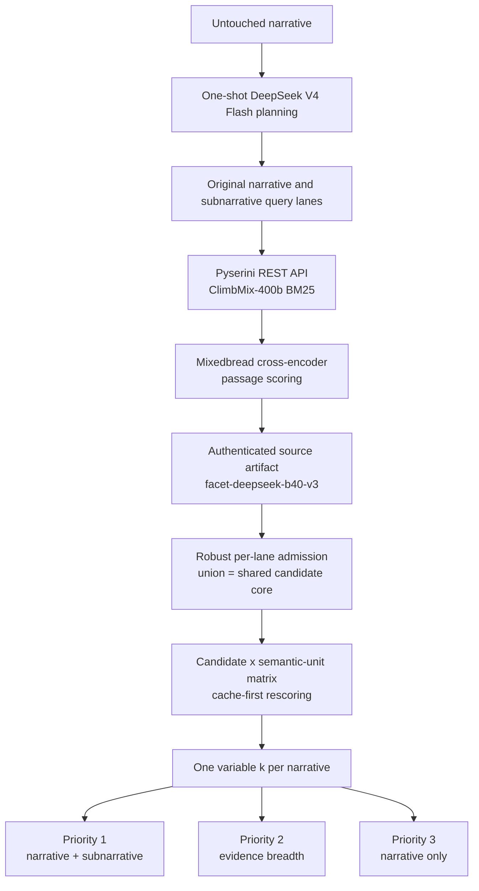

# Retrieval submission architecture

This bundle contains three TREC RAG 2026 Retrieval (`R`) runs. They share the
same narrative-specific candidate set and differ only in ordering. This makes
the comparison interpretable and lets all variants reuse one authenticated
score matrix.

## End-to-end design



The source run used the organizer's Pyserini REST API and `climbmix-400b`
BM25 index, with at most 1,000 internal candidates per query. It used a
bounded, one-shot `deepseek/deepseek-v4-flash-20260423` planner to produce
subnarratives and query variants. Candidate passages were scored with the
open-weight `mixedbread-ai/mxbai-rerank-base-v2` cross-encoder.

For this submission bundle, each authenticated `facet:<subnarrative>:text`
lane is treated as the available pooled source for that subnarrative. Planned
BM25 query strings are not counted as independent pools because the source
artifact does not contain distinct result lanes for them. No retrieval was
rerun. The final scoring replay used 167,597 cached query-passage scores, zero
cache misses, and zero model batches.

## Shared variable-depth candidate core

Let `D_u` be the documents present in authenticated source lane `u`, where `u`
is either the original narrative lane or one subnarrative lane. Let `A_u(d)`
be the lane's existing aggregate score for `d`. Compute:

```text
m_u   = median_{d in D_u} A_u(d)
MAD_u = median_{d in D_u} |A_u(d) - m_u|
```

A lane admits a document when:

```text
MAD_u > 0: A_u(d) >= m_u + 2.5 * 1.4826 * MAD_u
MAD_u = 0: A_u(d) > m_u
```

The final set is an inclusive union:

```text
C_t = C_original union C_subnarrative_1 union ... union C_subnarrative_n
k_t = |C_t|
```

If `C_t` were empty, the system would retain exactly the original-narrative
argmax, breaking ties by best source-retrieval rank and then UTF-8 document ID.
No topic needed that fallback. Across 119 narratives, `k_t` ranges from 1 to
121 with 61 distinct values. There is no fixed cutoff, padding, or truncation.

## Shared rescoring matrix

Every selected document is split with the semantic chunker (3,500 characters,
350-character overlap) and scored against the untouched narrative and every
subnarrative. Document-level semantic-unit scores are derived from the passage
scores. Percentiles normalize each semantic unit before the three orderings
are calculated. The candidate set, and therefore `k_t`, remains identical in
all runs.

## Ranking variants

### 1. Narrative + subnarrative

For each document:

```text
facet(d) = 0.7 * best_subnarrative_percentile(d)
         + 0.3 * second_best_subnarrative_percentile(d)

combo(d) = 0.5 * narrative_percentile(d) + 0.5 * facet(d)
```

If a narrative has only one subnarrative, `facet(d)` is that percentile. This
run balances overall narrative relevance with the strongest facet evidence.

### 2. Subnarrative evidence breadth

Documents are ordered lexicographically by:

1. number of distinct supported subnarratives;
2. number of strong overlap-suppressed supporting passages;
3. combo score from run 1;
4. best source-retrieval rank;
5. UTF-8 document ID.

Overlapping passages are suppressed within each document/subnarrative, at most
three passages are retained, and strength is determined with the same robust
raw-score rule. A document supported across more subnarratives therefore ranks
above one with concentrated evidence for only a single subnarrative.

### 3. Narrative only

Documents are ordered by untouched-narrative percentile, then best
source-retrieval rank and UTF-8 document ID. This isolates the value of the
original narrative while retaining the same facet-informed candidate set.

## System classification for Evalbase

| Portal dimension | Recorded answer | Rationale |
|---|---|---|
| Automatic or manual | `automatic` | No human selected or reordered documents. |
| Real run or pool enrichment | `real run` | Intended for official scoring. |
| Agents used in development | `Yes` | Codex agents assisted design, implementation, review, and validation. |
| Retrieval access | `combination of both` | Candidate documents came from the organizer API, then a custom local scoring and selection system reranked them. No custom index was used. |
| Retrieval category | `sparse/lexical` | The candidate retriever is BM25; neural reranking is declared separately. |
| Pipeline type | `multi-stage` | Planning, BM25 candidate retrieval, neural scoring, cutoff, and ordering are distinct fixed stages. |
| Neural networks | `Yes` | DeepSeek planning and Mixedbread cross-encoder scoring are neural. |
| Proprietary models | `No` | Runtime models are open-weight; hosted endpoints supplied inference only. |
| Open-weight models | `Yes` | DeepSeek V4 Flash is MIT-licensed and the Mixedbread reranker is Apache-2.0. |

The planning stage is bounded and one-shot, so the pipeline is multi-stage,
not iterative agentic search. Development agents never selected documents at
runtime. The source artifact's downstream canonical-nugget stage is outside
this baseline: these submissions consume the authenticated retrieval lanes and
reranker scores, not canonical claims, qrels, gold nuggets, or RAGDoll scores.

## Provenance and validation

- Source artifact: `outputs/facet-deepseek-b40-v3`
- Source export manifest SHA-256:
  `cb5a81608c48a5c43692ada0c9121cd96b7160589f08f5bbaf4e20612001463a`
- Mixedbread model revision:
  `3ea9d4dffa7d12a4f366be8e275c349de9fc9865`
- Official test narratives SHA-256:
  `72dc2fd358d3eeda973397ccd7a8775545b19a6deaefc67709167eee6a9f8a2c`

All three files contain the same 119 topic IDs and 4,246 topic-document rows,
use the required six fields, restart dense ranks at one, have non-increasing
scores, contain no duplicate topic-document pair, and use only `shard_*`
ClimbMix IDs. See `metadata.json` for compact provenance and
`retrieval-baseline-runs-manifest.json` for topic-level receipts.
